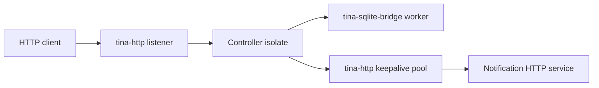

# Mini SaaS API

Copy this when you need a production-shaped Tina service skeleton, not a web
framework.

## Architecture



The controller isolate owns request workflow state (`next_id`, live item cache,
ingress-open flag). SQLite owns durable-ish item rows. The keepalive pool owns
outbound connection leases. No domain state is hidden behind
`Arc<Mutex<AppState>>`.

## Routes

| Route | Meaning |
| --- | --- |
| `GET /health` | Process/runtime can answer. |
| `GET /ready` | DB bridge and outbound pool can accept useful work. |
| `POST /items` | Create `name=<value>` after SQLite insert. |
| `GET /items/{id}` | Query SQLite before replying. |
| `POST /items/{id}/notify` | Query SQLite, acquire keepalive lease, call webhook, release lease, then reply. |
| `GET /debug/capacity` | Live capacity and pressure report. |

## Capacity

| Surface | Cap |
| --- | --- |
| HTTP body bytes | `32` for the public API listener |
| controller mailbox | `2` |
| SQLite bridge mailbox | `2` |
| SQLite pool shape | one in-flight connection, no waiters |
| outbound keepalive pool | one connection, zero waiters |

## Readiness

`/health` is liveness. `/ready` is useful-work readiness. It returns `503` with
typed reasons such as `db_closed`, `db_full`, `db_timeout`, `outbound_full`,
`outbound_closed`, or `ingress_stopped`.

## Shutdown Order

1. Mark public ingress closed in the controller.
2. Probe readiness over HTTP so `ingress_stopped` is visible.
3. Close the SQLite bridge.
4. Probe readiness so `db_closed` is visible.
5. Drain and stop the outbound keepalive pool with `shutdown_keepalive_pool`.
6. Stop the notification listener and public listener.
7. Shutdown the runtime and assert the terminal report/trace facts.

## Multi-Turn RequestContext

`POST /items/{id}/notify` proves the post-086 request pattern:

```text
HTTP call -> Controller CallContext
  -> into_request_context()
  -> SQLite query continuation
  -> outbound pool acquire continuation
  -> keepalive request continuation
  -> release continuation
  -> final HttpResponse
```

The route replies several turns after the original HTTP/controller call.
`Full`, `Closed`, and `Timeout` remain distinct in the route bodies.

## Live-Replay Fact

The smoke run prints a materialized fact:

```text
live_replay_fact case=mini_saas_body_full ops=[post:/items:41bytes] fact=status_413 cap=32
```

This is intentionally small: the operation is explicit, the fact is checked via
`tina_sim::dst` live-replay capture with a typed capacity surface, and a
cap/status mismatch fails the smoke run instead of being inferred from raw log
text.

## Commands

Run the system smoke from the repo root:

```sh
cargo test --manifest-path examples/systems/mini_saas_api/Cargo.toml
```

Run the documented executable smoke:

```sh
cargo run --manifest-path examples/systems/mini_saas_api/Cargo.toml -- smoke
```

Run the pressure variant:

```sh
cargo run --manifest-path examples/systems/mini_saas_api/Cargo.toml -- pressure
```

## Out Of Scope

No auth/session framework, no middleware stack, no macro router, no automatic
retry, no hidden DB pool semantics, no HTTPS claim, and no production readiness
claim from this small smoke.

## Findings

What felt good:
- `RequestContext` made the multi-turn route explicit.
- SQLite and keepalive pool pressure reports already had the right vocabulary.

What felt rough:
- The route body parsing is deliberately local and boring.
- Service-shaped live-replay facts still need a broader reusable saved-case
  story later.

Tina capability pulled:
- Native HTTP, SQLite bridge, keepalive pool, readiness, shutdown, capacity,
  and trace-derived multi-turn proof.

Suggested follow-up:
- Keep `reply_with_current_request(...)` as a tiny later polish phase only if
  more service code repeats the expanded form.

Verdict:
- keep
