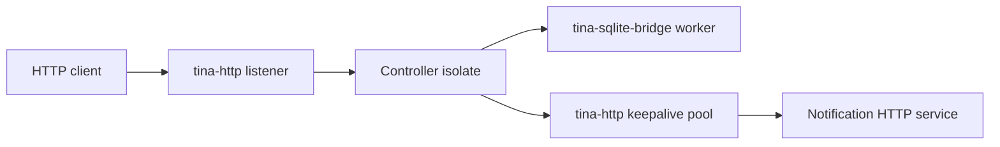

# Mini SaaS API

Copy this when you need a production-shaped Tina service skeleton, not a web
framework.

## Architecture



The controller isolate owns request workflow state (`next_id`, live item cache,
ingress-open flag). SQLite owns durable-ish item rows. The keepalive pool owns
outbound connection leases. No domain state is hidden behind
`Arc<Mutex<AppState>>`.

## Routes

| Route | Meaning |
| --- | --- |
| `GET /health` | Process/runtime can answer. |
| `GET /ready` | DB bridge and outbound pool can accept useful work. |
| `POST /items` | Create `name=<value>` after SQLite insert. |
| `GET /items/{id}` | Query SQLite before replying. |
| `POST /items/{id}/notify` | Query SQLite, acquire keepalive lease, call webhook, release lease, then reply. |
| `GET /debug/capacity` | Live capacity and pressure report. |

## Capacity

| Surface | Cap |
| --- | --- |
| HTTP body bytes | `32` for the public API listener |
| controller mailbox | `2` |
| SQLite bridge mailbox | `2` |
| SQLite pool shape | one in-flight connection, no waiters |
| outbound keepalive pool | one connection, zero waiters |

`GET /debug/capacity` returns a small key=value line with real HTTP body
current/high-water/full/timeout/io counters, controller mailbox cap, the
controller's typed `drain.stage` (`open` / `draining` / `stopped`), DB
capacity/waiters/in-flight/full/closed/timeout counts, and outbound keepalive
capacity/waiters/leased/full/closed/cancel counts. The stage field comes from
the `tina_runtime::DrainState` helper, so the same typed vocabulary appears
here as in any other Tina service that drains.

## Lifecycle

The typed `tina_runtime::lifecycle::Lifecycle` enum names every state the
service moves through. Each state means something specific:

| State | Meaning |
| --- | --- |
| `Starting` | Listeners not yet bound, bridges not yet installed. The service rejects traffic. |
| `Ready` | All bounded surfaces (DB pool, outbound pool, listener, body cap) accept useful work. |
| `Degraded` | A dependency is unhappy but new work can still land. `/ready` answers 200 with a typed reason for monitoring. |
| `Draining` | The controller has called `DrainState::begin`; ingress is closed; in-flight work is finishing. |
| `NotReady` | A dependency closed and the service cannot serve useful work. `/ready` returns 503 with `<dep>_closed`. |
| `Stopped` | Final state emitted in the terminal `ServiceShutdownReport`. The runtime has shut down. |

`Lifecycle::admits_new_work()` is `true` only for `Ready` and `Degraded`. The
helper is plain data; the controller decides which state it is in.

`/health` answers process liveness ("alive\n"). The typed
`RunReport::health_pre_shutdown` snapshot pairs the controller's current
[`Lifecycle`](https://docs.rs/tina_runtime/lifecycle::Lifecycle) with the
last live pressure report so dashboards can show "state + bounded surfaces"
in one place.

`/ready` answers useful-work readiness. The handler builds a typed
`Readiness` from `ReadinessReason` variants (`IngressStopped`,
`DependencyClosed("db")`, `DependencyFull("outbound")`, etc.) and renders
the legacy wire body (`ready\n` or `not_ready reasons=<csv>\n`) so existing
clients keep working.

## Shutdown Order

The host wraps the sequence in a `ShutdownChoreography`. Each step records
its kind, label, elapsed time, and outcome; the terminal
`ServiceShutdownReport` is in `RunReport::shutdown_report`. Per-resource
close reports use the shared `ResourceCloseReport` vocabulary (name, kind,
admission, outcome) so a dashboard reads the same shape no matter which
resource closed.

1. `StopIngress` — `ControllerMsg::CloseIngress` flips
   `DrainState::begin`, so the next public request reads
   `drain.is_open() == false` and replies `ingress_stopped`.
2. `DrainInFlight` — wait for one already-admitted slow notify request to
   finish with a typed reply.
3. Probe readiness over HTTP so `ingress_stopped` is visible.
4. Probe `/debug/capacity` so `drain.stage=draining` is visible.
5. Send one new POST and prove the typed `503 ingress_stopped` reply.
6. `CloseResource db.bridge` — close the SQLite bridge. The choreography
   records the `ResourceCloseReport` (kind=`bridge`, admission=`drain`).
7. Probe readiness so `db_closed` is visible.
8. `CloseResource outbound.pool` — drain and stop the outbound keepalive
   pool with `shutdown_keepalive_pool`. The `KeepalivePoolShutdownReport`
   numbers are folded into the `ResourceCloseReport` details string.
9. `CloseResource notify.listener` and `CloseResource main.listener` —
   stop both HTTP listeners.
10. `StopOwner` — shutdown the runtime. Assert the terminal trace facts.

`ShutdownChoreography` flags out-of-order recordings with
`StepOutcome::OrderingViolation`; the terminal report's `clean` flag goes
false if any step is misordered or times out. The controller stays in
`Draining` while the host owns terminal proof; the typed `Stopped` state is
the one written into the terminal `ServiceShutdownReport` /
`Health::state`. `examples/systems/system_metrics_shipper` shows the
service-owned drain shape where `DrainState::finish` is reached inside the
isolate.

## Multi-Turn Replies

`POST /items/{id}/notify` proves the current request pattern:

```text
HTTP call -> Controller CallContext
  -> call_ctx.defer(SQLite query).reply(NotifyLoaded)
  -> call(...).then_with_request(req, NotifyAcquired)   // outbound pool acquire
  -> call(...).then_with_request(req, NotifySent)       // keepalive request
  -> call(...).then_with_request(req, NotifyReleased)   // pool release
  -> reply_to_request(req, ...)                          // final HttpResponse
```

The first hop uses `call_ctx.defer(work).reply(...)` to consume caller
authority and carry it into the next continuation as `RequestContext<R>`.
Each follow-on hop calls `then_with_request(req, ...)` to keep that context
moving across messages. The final turn settles the caller with
`reply_to_request`. There is no hidden caller context preservation; `Full`,
`Closed`, and `Timeout` remain distinct in the route bodies at every hop.

## Live-Replay Fact

The smoke run prints a materialized fact:

```text
live_replay_fact case=mini_saas_body_full ops=[post:/items:41bytes] fact=status_413 cap=32
```

This is intentionally small: the operation is explicit, the fact is checked via
`tina_sim::dst` live-replay capture with a typed capacity surface, and a
cap/status mismatch fails the smoke run instead of being inferred from raw log
text.

## Commands

Run the system smoke from the repo root:

```sh
# Full system smoke (scripted scenarios + capacity assertions):
cargo test --manifest-path examples/systems/mini_saas_api/Cargo.toml --test smoke

# Load/soak proof (Phase 108) with typed capacity contract:
cargo test --manifest-path examples/systems/mini_saas_api/Cargo.toml --test soak -- --nocapture
```

The soak proof drives 4 workers × 240 ops across three lanes
(`/health`, `/items/1`, `/items/1/notify`) via
`tina_proof_harness::load`. Sample one-line output:

```text
soak load label=mini_saas_api_soak workers=4 ops=240 ok=206 err=34 timeout=0 \
  min_us=422 p50_us=709 p99_us=3305 max_us=3756 elapsed_ms=59 leak_clean=true \
  pressure total=34 rate_per_mille=141 max_consecutive=2 first_err_op=0 by_kind=[http_503:34] \
  shutdown_clean=true capacity={ ... db.full=34 outbound.full=0 runtime.send_full=0 ... }
```

The contract: every harness 5xx must map to a typed pressure event on
the controller's `/debug/capacity` line or the live runtime pressure
trace — `db.full`, `outbound.full`, or `runtime.*_full`. If those
typed counters do not cover `ops_err`, the test fails closed because
pressure is escaping the typed surface. The
typed `pressure` summary on the load report (rate, burst length,
first error position, per-kind breakdown) lets specimens assert
"pressure stayed under N per mille" or "no burst longer than K
consecutive errors" without parsing the summary line.

What this exposes when it fails:

- `ops_timeout > 0` → transport hung; the listener or connection
  drain path stopped accepting work mid-load.
- `leak_clean=false` → the load harness's leak hook returned false
  (currently unused but reserved for future capacity-snapshot probes).
- `db.full + outbound.full + runtime.*_full < ops_err` → some pressure
  path is returning 5xx without a matching typed event. That is the
  hidden-pressure regression the soak is designed to catch.
- `shutdown_clean=false` → the keepalive pool drained dirty (leaked
  in-flight, timed out, or hit `connection_failures`).

Run the documented executable smoke:

```sh
cargo run --manifest-path examples/systems/mini_saas_api/Cargo.toml -- smoke
```

The test smoke asserts the exact user-visible status/body sequence for health,
readiness, create, read, notify, notify-after-peer-close, missing item, wrong
method, malformed create, parser body cap, duplicate create, in-flight shutdown
notify, ingress-closed rejection, and DB-closed readiness. The peer-close case
forces the upstream notification server to answer with `Connection: close`, then
proves the one-slot keepalive pool still serves the next notification by
releasing successful requests with `Reuse`. The parser body-cap observation has
an empty body because `tina-http` rejects the oversized request before
dispatching to the controller isolate. The tests parse live capacity and
terminal shutdown reports as key=value fields, reject duplicate keys, and check
pre-shutdown, during-shutdown, and terminal views separately.

Run the pressure variant:

```sh
cargo run --manifest-path examples/systems/mini_saas_api/Cargo.toml -- pressure
```

The pressure variant holds the one outbound keepalive lease with a slow notify
request, sends a second notify, and asserts the user sees
`503 outbound_full` while the first notify still succeeds.

This specimen keeps shutdown host-driven so the whole service shape fits in
one copied system. Larger services can move the same order into a coordinator
isolate and publish the terminal report with `stop_with(report)` /
`observe_result`.

## Out Of Scope

No auth/session framework, no middleware stack, no macro router, no automatic
retry, no hidden DB pool semantics, no HTTPS claim, and no production readiness
claim from this small smoke.

## Findings

What felt good:
- `call_ctx.defer(...).reply(...)` for the first hop plus
  `then_with_request(...)` for follow-on hops keeps the caller-preserving path
  easy to copy without hidden context.
- `DrainState` names the host-driven `Open` → `Draining` transition with
  one typed stage field in `/debug/capacity`, instead of hiding it behind a
  service-local `bool`.
- SQLite and keepalive pool pressure reports already had the right vocabulary.
- `tina_runtime::lifecycle::ShutdownChoreography` collapses the host
  shutdown sequence into one builder that records typed step kinds,
  per-resource close reports, and ordering violations. The shutdown loop
  in `tina_impl.rs` reads top-to-bottom instead of being a string of
  unrelated `try_send`/`shutdown_keepalive_pool` calls with a hand-built
  terminal line at the end. The typed `ServiceShutdownReport` lives on
  `RunReport::shutdown_report` and the smoke test pattern-matches on it
  instead of grepping `terminal_line`.
- `Readiness` + `ReadinessReason` replace the stringly-typed
  `ready_reasons(&[...])` helper. The legacy HTTP body (`not_ready
  reasons=<csv>`) is now generated by `Readiness::legacy_body()` so the
  wire format stays identical while the call sites traffic in typed
  variants.

What felt rough:
- The route body parsing is deliberately local and boring.
- Service-shaped live-replay facts still need a broader reusable saved-case
  story later.

Tina capability pulled:
- Native HTTP, SQLite bridge, keepalive pool, readiness, shutdown, capacity,
  `DrainState`, typed `Lifecycle` / `ServiceTopology` / `ShutdownChoreography`,
  and trace-derived multi-turn proof.

Suggested follow-up:
- Move the `pool_shutdown_to_close_report` adapter into `tina-http` if a
  second service repeats the exact same conversion.

Verdict:
- keep

## Service product surface (Phase 111)

`RunReport::service_report` is the typed
[`ServiceReport`](../../../tina-runtime/src/service_report.rs) built
through `ServiceReportBuilder`. It threads lifecycle, readiness, health,
topology, pressure, the typed `ServiceShutdownReport`, and the replay
status into one validated report.

The summary line shape (pinned by `smoke_service_report_lines_match_readme`):

```text
service=mini_saas_api lifecycle=stopped ready=false health=stopped
 pressure=1 surfaces_full=false unavailable=0
 shutdown=clean:true replay=available
```

The shutdown summary line (pinned by `smoke_service_report_threads_every_component`):

```text
shutdown service=mini_saas_api clean=true steps=7 closes=4
 elapsed_us=<n> violations=0 timeouts=0 failures=0
```

Run it:

```sh
cargo test --manifest-path examples/systems/mini_saas_api/Cargo.toml \
    --test smoke smoke_service_report_threads_every_component -- --nocapture
```

Pressure surfaces sampled live (the sqlite bridge in-flight, the
outbound bridge in-flight) appear as **explicit `Unavailable` lines**
in the startup pressure surface set, not silent omissions.
