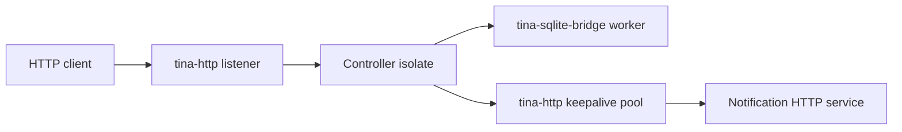

# Mini SaaS API

Copy this when you need a production-shaped Tina service skeleton, not a web
framework.

## Architecture



The controller isolate owns request workflow state (`next_id`, live item cache,
ingress-open flag). SQLite owns durable-ish item rows. The keepalive pool owns
outbound connection leases. No domain state is hidden behind
`Arc<Mutex<AppState>>`.

## Routes

| Route | Meaning |
| --- | --- |
| `GET /health` | Process/runtime can answer. |
| `GET /ready` | DB bridge and outbound pool can accept useful work. |
| `POST /items` | Create `name=<value>` after SQLite insert. |
| `GET /items/{id}` | Query SQLite before replying. |
| `POST /items/{id}/notify` | Query SQLite, acquire keepalive lease, call webhook, release lease, then reply. |
| `GET /debug/capacity` | Live capacity and pressure report. |

## Capacity

| Surface | Cap |
| --- | --- |
| HTTP body bytes | `32` for the public API listener |
| controller mailbox | `2` |
| SQLite bridge mailbox | `2` |
| SQLite pool shape | one in-flight connection, no waiters |
| outbound keepalive pool | one connection, zero waiters |

`GET /debug/capacity` returns a small key=value line with real HTTP body
current/high-water/full/timeout/io counters, controller mailbox cap, drain
stage and admit counters (`drain.stage`, `drain.admitted`,
`drain.admits_after_drain`), DB capacity/waiters/in-flight/full/closed/timeout
counts, and outbound keepalive capacity/waiters/leased/full/closed/cancel
counts. The drain fields come from the `tina_runtime::DrainState` helper, so a
`drain.stage=draining` reading is the same typed truth a service would publish
in any other shape.

## Readiness

`/health` is liveness. `/ready` is useful-work readiness. It returns `503` with
typed reasons such as `db_closed`, `db_full`, `db_timeout`, `outbound_full`,
`outbound_closed`, or `ingress_stopped`.

## Shutdown Order

1. Begin the controller drain (`DrainState::begin`) so admission flips to
   `Stopping`.
2. Let one already-admitted slow notify request finish with a typed reply.
3. Probe readiness over HTTP so `ingress_stopped` is visible.
4. Send one new POST and prove the typed `503 ingress_stopped` reply.
5. Probe `/debug/capacity` so `drain.stage=draining` and
   `drain.admits_after_drain >= 1` are visible in the report.
6. Close the SQLite bridge.
7. Probe readiness so `db_closed` is visible.
8. Drain and stop the outbound keepalive pool with `shutdown_keepalive_pool`.
9. Stop the notification listener and public listener.
10. Shutdown the runtime and assert the terminal report/trace facts.

## Multi-Turn Replies

`POST /items/{id}/notify` proves the current request pattern:

```text
HTTP call -> Controller CallContext
  -> call_ctx.defer(SQLite query).reply(NotifyLoaded)
  -> call(...).then_with_request(req, NotifyAcquired)   // outbound pool acquire
  -> call(...).then_with_request(req, NotifySent)       // keepalive request
  -> call(...).then_with_request(req, NotifyReleased)   // pool release
  -> reply_to_request(req, ...)                          // final HttpResponse
```

The first hop uses `call_ctx.defer(work).reply(...)` to consume caller
authority and carry it into the next continuation as `RequestContext<R>`.
Each follow-on hop calls `then_with_request(req, ...)` to keep that context
moving across messages. The final turn settles the caller with
`reply_to_request`. There is no hidden caller context preservation; `Full`,
`Closed`, and `Timeout` remain distinct in the route bodies at every hop.

## Live-Replay Fact

The smoke run prints a materialized fact:

```text
live_replay_fact case=mini_saas_body_full ops=[post:/items:41bytes] fact=status_413 cap=32
```

This is intentionally small: the operation is explicit, the fact is checked via
`tina_sim::dst` live-replay capture with a typed capacity surface, and a
cap/status mismatch fails the smoke run instead of being inferred from raw log
text.

## Commands

Run the system smoke from the repo root:

```sh
cargo test --manifest-path examples/systems/mini_saas_api/Cargo.toml
```

Run the documented executable smoke:

```sh
cargo run --manifest-path examples/systems/mini_saas_api/Cargo.toml -- smoke
```

The test smoke asserts the exact user-visible status/body sequence for health,
readiness, create, read, notify, notify-after-peer-close, missing item, wrong
method, malformed create, parser body cap, duplicate create, in-flight shutdown
notify, ingress-closed rejection, and DB-closed readiness. The peer-close case
forces the upstream notification server to answer with `Connection: close`, then
proves the one-slot keepalive pool still serves the next notification by
releasing successful requests with `Reuse`. The parser body-cap observation has
an empty body because `tina-http` rejects the oversized request before
dispatching to the controller isolate. The tests parse live capacity and
terminal shutdown reports as key=value fields, reject duplicate keys, and check
pre-shutdown, during-shutdown, and terminal views separately.

Run the pressure variant:

```sh
cargo run --manifest-path examples/systems/mini_saas_api/Cargo.toml -- pressure
```

The pressure variant holds the one outbound keepalive lease with a slow notify
request, sends a second notify, and asserts the user sees
`503 outbound_full` while the first notify still succeeds.

This specimen keeps shutdown host-driven so the whole service shape fits in
one copied system. Larger services can move the same order into a coordinator
isolate and publish the terminal report with `stop_with(report)` /
`observe_result`.

## Out Of Scope

No auth/session framework, no middleware stack, no macro router, no automatic
retry, no hidden DB pool semantics, no HTTPS claim, and no production readiness
claim from this small smoke.

## Findings

What felt good:
- `call_ctx.defer(...).reply(...)` for the first hop plus
  `then_with_request(...)` for follow-on hops keeps the caller-preserving path
  easy to copy without hidden context.
- `DrainState` carries the typed `Open` / `Draining` / `Stopped` vocabulary
  and admit counters in one explicit place, so the capacity report names
  the drain truth instead of hiding it behind a service-local `bool`.
- SQLite and keepalive pool pressure reports already had the right vocabulary.

What felt rough:
- The route body parsing is deliberately local and boring.
- Service-shaped live-replay facts still need a broader reusable saved-case
  story later.

Tina capability pulled:
- Native HTTP, SQLite bridge, keepalive pool, readiness, shutdown, capacity,
  `DrainState`, and trace-derived multi-turn proof.

Suggested follow-up:
- Keep shutdown/report formatting local until another system repeats the same
  exact shape.

Verdict:
- keep
